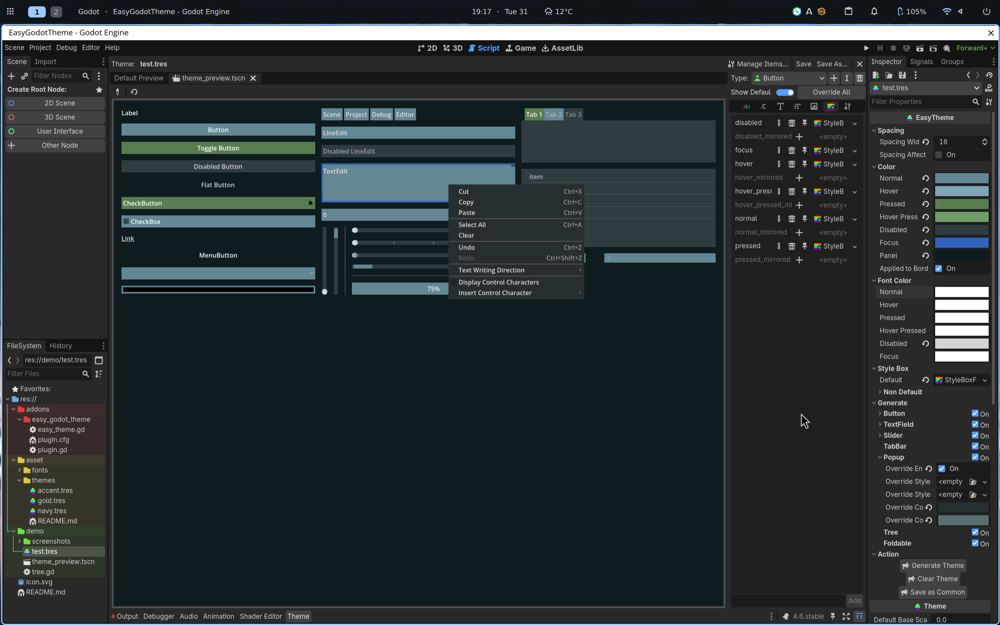

## Godot Easy Theme
Godot 4.6+ is recommended, though earlier versions should be supported too

### What is a Godot Theme
[Theme](https://docs.godotengine.org/en/4.6/tutorials/ui/gui_skinning.html), is a powerful concept that allows you for skinning your GUI in [Godot](https://docs.godotengine.org/)

However, if you once tried creating a godot theme from scratch yourself, you will notice many annoying problems. 
For instance, if you want to override the default color of a slider, you must apply the same configuration to both `VSlider` and `HSlider` in the theme editor 
Also, it is so easy to miss some controls options and leave them uncovered.

### What is this addon
[This addon](https://github.com/Silver1078682/EasyGodotTheme) introduces a EasyTheme class to spare you the headaches mentioned above.

> creating this theme only requires 16 option changes in inspector deck

As you see, the addon automatically handles the most common options for you, and you only need to modify the options you want.
It greatly reduces the number of steps you need to take to create a theme, and makes it much easier to prototype your GUI.

### How to install
1. git clone the project
2. copy the `addons/easy_godot_theme` folder to your godot project
3. enable the addons in your project settings

   
### How to use
1. Create an `EasyTheme`
    1. right click your file system deck
    2. Create New ... > Resource ... > `EasyTheme`
2. Select the `EasyTheme` you just created and modify the options in the inspector deck
3. expand `Action` export group in your inspector, click `GenerateTheme` and see the changes.
5. Hover on an option to see its description.
6. (Optional)After you are done, click `Save as Common` button to export the theme to an ordinary theme file.

> [!TIP]
    Whenever you click `GenerateTheme`, the automated settings will be applied and it *may or may not* override theme settings you manually configured in theme editor.  
    The best practice is to configure your theme as `EasyTheme` in inspector deck and avoid using the theme editor to fine-tune the theme. 
    If you still want to fine-tune your theme, click `Save as Common` to export it as a common theme file and configure it in your theme editor. 

### TODO
- [ ] more documentation
- [ ] better editing experience for even native Theme class.

> [!WARNING]
    This is a **WIP** project and there could be breaking changes *(very unlikely though)*.
	You are welcome to report any issues you encounter.
	
